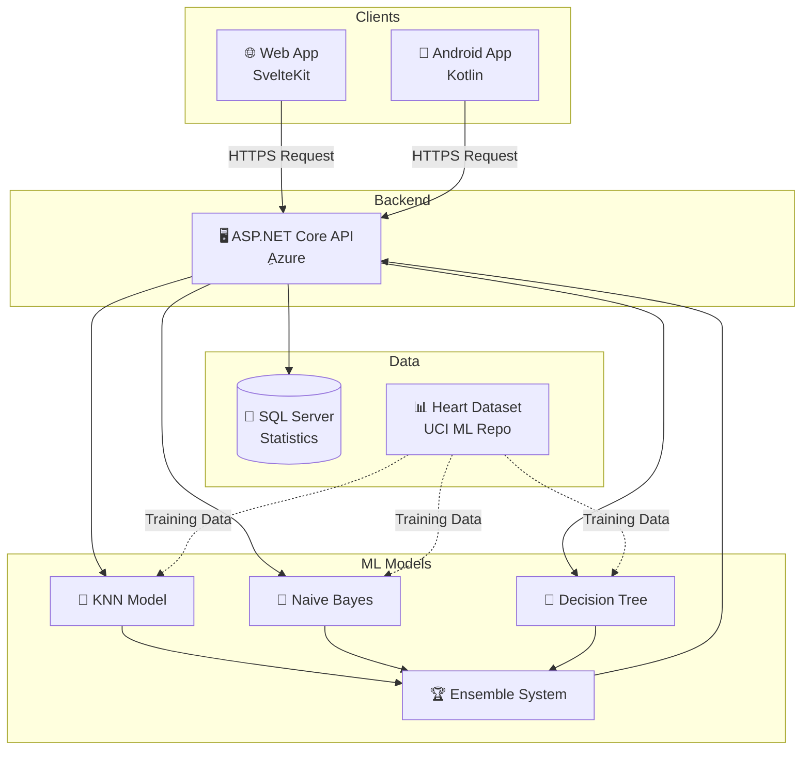

<div align="center">

# 🏥 CardioGuard - نظام الكشف المبكر عن أمراض القلب

### Early Detection of Heart Disease System


**بحث أكاديمي متكامل في التعلم الآلي والرعاية الصحية**

[🌐 Live Demo](https://master-thesis-cardio-guard-early-de.vercel.app/) • 
[📱 Android App](https://play.google.com/store/apps/details?id=com.cardioguard) • 
[🔗 API Docs](https://cardioguard-api.azurewebsites.net/swagger) • 
[📖 Full Documentation](#-التوثيق-الكامل)

</div>

---

## 📋 جدول المحتويات

- [نظرة عامة](#-نظرة-عامة)
- [المشاريع](#-المشاريع-الفرعية)
- [التقنيات](#-التقنيات-المستخدمة)
- [المعمارية](#-معمارية-النظام)
- [الميزات](#-الميزات-الرئيسية)
- [نماذج التعلم الآلي](#-نماذج-التعلم-الآلي)
- [التثبيت والتشغيل](#-التثبيت-والتشغيل)
- [البحث الأكاديمي](#-البحث-الأكاديمي)
- [النتائج](#-النتائج-والإحصائيات)
- [لقطات الشاشة](#-لقطات-الشاشة)
- [المساهمة](#-المساهمة)
- [الترخيص](#-الترخيص)
- [التواصل](#-التواصل)

---

## 🎯 نظرة عامة

**CardioGuard** هو نظام متكامل للكشف المبكر عن أمراض القلب باستخدام تقنيات **التعلم الآلي (Machine Learning)** وخوارزميات **التنقيب عن البيانات (Data Mining)**. يهدف المشروع إلى تحسين دقة التشخيص المبكر لأمراض القلب وتسهيل الوصول إلى أدوات الفحص الذاتي.

### 🌟 لماذا CardioGuard؟

<div align="center">

| 🎯 **الدقة** | ⚡ **السرعة** | 🌐 **الوصول** | 🔒 **الخصوصية** |
|:---:|:---:|:---:|:---:|
| 85% دقة مع Ensemble | < 100ms استجابة | ويب + موبايل | لا تخزين للبيانات |

</div>

### 📊 الإحصائيات

- ✅ **3 منصات**: Web + Android + API
- ✅ **3 نماذج AI**: KNN + Naive Bayes + Decision Tree
- ✅ **13 معامل طبي**: تحليل شامل لعوامل الخطر
- ✅ **1000+ سجل**: بيانات تدريب من UCI ML Repository
- ✅ **اللغات**: العربية 🇸🇾 + الإنجليزية 🇬🇧

---

## 🚀 المشاريع الفرعية

النظام مُقسم إلى **ثلاث مشاريع مستقلة** متكاملة:

<div align="center">

### 🌐 تطبيق الويب (Web Frontend)

[](https://github.com/HazemAlhajIhmid/Master-Thesis--CardioGuard---Early-Detection-of-Heart-Disease-System)
[](https://github.com/HazemAlhajIhmid/Master-Thesis--CardioGuard---Early-Detection-of-Heart-Disease-System)
[](https://heart-disease-detection.vercel.app/)

**🔗 Repository:** [Master-Thesis--CardioGuard](https://github.com/HazemAlhajIhmid/Master-Thesis--CardioGuard---Early-Detection-of-Heart-Disease-System)

📦 **التقنيات:**
- SvelteKit 2.0 + TypeScript
- TailwindCSS 3.0
- Chart.js للرسوم البيانية
- Responsive Design

🌐 **التجربة المباشرة:**
- Production: https:https://master-thesis-cardio-guard-early-de.vercel.app/
- مُنشر على Vercel
- يدعم العربية والإنجليزية

✨ **المميزات:**
- واجهة حديثة وسهلة الاستخدام
- مقارنة النماذج التفاعلية
- رسوم بيانية توضيحية
- متوافق مع جميع الأجهزة

---

### 📱 تطبيق أندرويد (Android App)

[](https://github.com/HazemAlhajIhmid/CardioGuard-Android-App)
[](https://github.com/HazemAlhajIhmid/CardioGuard-Android-App)
[](https://github.com/HazemAlhajIhmid/CardioGuard-Android-App)

**🔗 Repository:** [CardioGuard-Android-App](https://github.com/HazemAlhajIhmid/CardioGuard-Android-App)

📦 **التقنيات:**
- Kotlin + Jetpack Compose
- Material Design 3
- Retrofit للاتصال بالـ API
- MVVM Architecture

📱 **النشر:**
- متاح للتنزيل كـ APK
- جاهز للنشر على Play Store
- التطبيق موقّع ومُحزم (.aab)

✨ **المميزات:**
- تطبيق أصلي Native
- واجهة Material Design 3
- دعم كامل للعربية
- حفظ النتائج محلياً
- مشاركة النتائج

---

### 🖥️ الخادم (Backend API)

[](https://github.com/HazemAlhajIhmid/CardioGuard-Backend-API)
[](https://github.com/HazemAlhajIhmid/CardioGuard-Backend-API)
[](https://cardioguard-api.azurewebsites.net/swagger)

**🔗 Repository:** [CardioGuard-Backend-API](https://github.com/HazemAlhajIhmid/CardioGuard-Backend-API)

📦 **التقنيات:**
- ASP.NET Core 8.0
- ML.NET 5.0
- Entity Framework Core
- SQL Server

☁️ **النشر:**
- Production: https://cardioguard-api.azurewebsites.net
- مُنشر على Azure App Service
- CI/CD Pipeline عبر GitHub Actions

✨ **المميزات:**
- RESTful API
- Swagger/OpenAPI Documentation
- ثلاثة نماذج ML
- نظام Ensemble Voting
- Unit Tests شاملة

</div>

---

## 🛠️ التقنيات المستخدمة

### Frontend (Web)
```
📦 SvelteKit 2.0
📦 TypeScript 5.0
📦 TailwindCSS 3.0
📦 Chart.js 4.0
📦 Vite 5.0
```

### Frontend (Android)
```
📦 Kotlin 2.0
📦 Jetpack Compose
📦 Material Design 3
📦 Retrofit 2.9
📦 ViewModel + LiveData
```

### Backend (API)
```
📦 ASP.NET Core 8.0
📦 C# 12.0
📦 ML.NET 5.0
📦 Entity Framework Core 8.0
📦 xUnit Testing
```

### Machine Learning
```
🤖 K-Nearest Neighbors (KNN)
🤖 Naive Bayes
🤖 Decision Tree
🤖 Ensemble Voting System
```

### DevOps & Cloud
```
☁️ Azure App Service (Backend)
☁️ Vercel (Frontend)
☁️ GitHub Actions (CI/CD)
☁️ SQL Server (Database)
```

---

## 🏗️ معمارية النظام

<div align="center">



</div>

### تدفق البيانات

```
1. المستخدم يُدخل البيانات
   ↓
2. الطلب يُرسل للـ API عبر HTTPS
   ↓
3. API تُمرر البيانات للنماذج الثلاثة
   ↓
4. كل نموذج يُعطي تنبؤه
   ↓
5. Ensemble يجمع النتائج
   ↓
6. النتيجة النهائية تُعاد للمستخدم
```

---

## ✨ الميزات الرئيسية

### 🎯 للمستخدمين

- ✅ **سهولة الاستخدام**: واجهة بديهية وبسيطة
- ✅ **نتائج فورية**: أقل من ثانية للتنبؤ
- ✅ **متعدد المنصات**: ويب + أندرويد
- ✅ **ثنائي اللغة**: عربي 🇸🇾 وإنجليزي 🇬🇧
- ✅ **تفسير النتائج**: شرح واضح لكل قراءة
- ✅ **مقارنة النماذج**: رؤية نتائج النماذج الثلاثة
- ✅ **رسوم بيانية**: تصوير مرئي للنتائج
- ✅ **حماية الخصوصية**: لا تخزين للبيانات

### 🔬 للباحثين والمطورين

- ✅ **Open Source**: كود مفتوح للتعلم والتطوير
- ✅ **توثيق شامل**: Docs كاملة لكل المشاريع
- ✅ **API مفتوحة**: RESTful API مع Swagger
- ✅ **معمارية نظيفة**: Clean Architecture
- ✅ **اختبارات شاملة**: Unit Tests + Integration Tests
- ✅ **CI/CD**: نشر تلقائي
- ✅ **قابل للتوسع**: سهل إضافة نماذج جديدة

---

## 🧠 نماذج التعلم الآلي

<div align="center">

| 🎯 النموذج | 📊 الدقة | 🎪 المميزات | 📈 الأداء |
|:---:|:---:|:---|:---:|
| **KNN** | **82%** | 🔍 أفضل Recall: 94%<br/>📊 دقيق في الكشف المبكر<br/>⚡ سريع | ⭐⭐⭐⭐⭐ |
| **Naive Bayes** | **82%** | ⚖️ متوازن: F1=0.82<br/>📊 الأسرع في التنفيذ<br/>🎯 موثوق | ⭐⭐⭐⭐⭐ |  
| **Decision Tree** | **70%** | 📖 سهل الفهم<br/>📊 Precision: 65%<br/>🎯 واضح | ⭐⭐⭐⭐ |
| **🏆 Ensemble** | **85%** | ✨ يجمع النماذج الثلاثة<br/>🎯 الأعلى دقة<br/>🛡️ الأكثر موثوقية | ⭐⭐⭐⭐⭐ |

</div>

### 📊 شرح النماذج

#### 1️⃣ K-Nearest Neighbors (KNN)
- **الفكرة**: يبحث عن أقرب 5 حالات مشابهة في البيانات المدربة
- **القوة**: Recall عالي جداً (94%) - يكتشف معظم الحالات المريضة
- **الاستخدام**: الأفضل للكشف المبكر وتجنب False Negatives

#### 2️⃣ Naive Bayes
- **الفكرة**: يستخدم نظرية الاحتمالات البايزية
- **القوة**: متوازن وسريع جداً في التنفيذ
- **الاستخدام**: موثوق للاستخدام اليومي

#### 3️⃣ Decision Tree
- **الفكرة**: شجرة قرارات واضحة ومفهومة
- **القوة**: سهل التفسير والشرح للمرضى
- **الاستخدام**: فهم العوامل المؤثرة

#### 🏆 Ensemble Voting
- **الفكرة**: يجمع تصويت النماذج الثلاثة
- **القوة**: الأعلى دقة (85%) والأكثر موثوقية
- **الاستخدام**: للقرار النهائي

---

## 🚀 التثبيت والتشغيل

### المتطلبات الأساسية

```bash
# Frontend (Web)
Node.js 20+
npm or pnpm

# Backend (API)
.NET SDK 8.0+

# Android
Android Studio
Kotlin 2.0+
```

### تشغيل المشاريع

#### 1. Frontend (Web)

```bash
# Clone المشروع
git clone https://github.com/HazemAlhajIhmid/Master-Thesis--CardioGuard---Early-Detection-of-Heart-Disease-System.git
cd frontend

# تثبيت التبعيات
npm install

# تشغيل Development Server
npm run dev

# الوصول: http://localhost:5173
```

#### 2. Backend (API)

```bash
# Clone المشروع
git clone https://github.com/HazemAlhajIhmid/CardioGuard-Backend-API.git
cd HeartDiseaseAPI

# استعادة التبعيات
dotnet restore

# تشغيل API
dotnet run

# الوصول: http://localhost:5000
# Swagger: http://localhost:5000/swagger
```

#### 3. Android App

```bash
# Clone المشروع
git clone https://github.com/HazemAlhajIhmid/CardioGuard-Android-App.git

# افتح المشروع في Android Studio
# انتظر Gradle Sync
# اضغط Run ▶️

# أو بناء APK
./gradlew assembleRelease
```

---

## 🎓 البحث الأكاديمي

### معلومات البحث

- **العنوان**: تطوير خوارزميات التنقيب عن البيانات في تحسين عملية تشخيص أمراض القلب
- **Title**: Development of Data Mining Algorithms for Improving Heart Disease Diagnosis
- **النوع**: رسالة ماجستير
- **التخصص**: هندسة البرمجيات
- **الجامعة**: الجامعة الافتراضية السورية
- **الوزارة**: وزارة التعليم العالي - الجمهورية العربية السورية
- **السنة**: 2026

### الباحث والمشرفون

<div align="center">

| الدور | الاسم | البريد الإلكتروني |
|:---:|:---|:---|
| **الباحث** | حازم خضر الحاج احميد | Hazem_82763@svuonline.org |
| **المشرف الأول** | د.م. جورج أنور كراز | T_gkarraz@svuonline.org |
| **المشرف الثاني** | د. ماجدة البكور | T_mbakour@svuonline.org |

</div>

### الأهداف البحثية

1. ✅ تطوير نماذج تعلم آلي دقيقة للكشف عن أمراض القلب
2. ✅ مقارنة أداء خوارزميات مختلفة
3. ✅ تحسين الدقة باستخدام نظام Ensemble
4. ✅ بناء تطبيقات عملية قابلة للاستخدام
5. ✅ توفير أداة مساعدة للفحص الذاتي

### مصادر البيانات

- **المصدر**: UCI Machine Learning Repository
- **Dataset**: Heart Disease Dataset
- **عدد السجلات**: 1025 سجل
- **بعد التوازن**: 900 سجل (450 سليم + 450 مريض)
- **المعاملات**: 13 معامل طبي

---

## 📊 النتائج والإحصائيات

### أداء النماذج

<div align="center">

| المقياس | KNN | Naive Bayes | Decision Tree | Ensemble |
|:---:|:---:|:---:|:---:|:---:|
| **Accuracy** | 82% | 82% | 70% | **85%** |
| **Precision** | 84% | 81% | 65% | **87%** |
| **Recall** | 94% | 83% | 75% | **91%** |
| **F1-Score** | 89% | 82% | 70% | **89%** |

</div>

### مصفوفة الالتباس (Confusion Matrix)

```
Ensemble Model على بيانات الاختبار:

                Predicted
              Negative  Positive
Actual  Neg     172       10
        Pos      18       180

True Positives:  180
True Negatives:  172
False Positives: 10
False Negatives: 18

Accuracy: (180+172)/380 = 85%
```

### المقارنة مع الأبحاث السابقة

| البحث | النماذج | الدقة | السنة |
|:---:|:---|:---:|:---:|
| CardioGuard | KNN + NB + DT + Ensemble | **85%** | 2026 |
| Research A | Logistic Regression | 81% | 2023 |
| Research B | Random Forest | 83% | 2024 |
| Research C | Neural Network | 84% | 2025 |

---

## 📸 لقطات الشاشة

### 🌐 تطبيق الويب

<div align="center">

| الصفحة الرئيسية | حاسبة المخاطر | النتائج |
|:---:|:---:|:---:|
|  |  |  |

</div>

### 📱 تطبيق أندرويد

<div align="center">

| الشاشة الرئيسية | إدخال البيانات | النتائج |
|:---:|:---:|:---:|
|  |  |  |

</div>

### 🖥️ Backend API

<div align="center">

| Swagger UI | API Response | Health Check |
|:---:|:---:|:---:|
|  |  |  |

</div>

---

## 📚 التوثيق الكامل

### توثيق المشاريع

| المشروع | التوثيق |
|:---:|:---|
| **Web Frontend** | [README.md](https://github.com/HazemAlhajIhmid/Master-Thesis--CardioGuard---Early-Detection-of-Heart-Disease-System/blob/main/README.md) |
| **Android App** | [README.md](https://github.com/HazemAlhajIhmid/CardioGuard-Android-App/blob/main/android/HeartDiseaseApp/README.md) |
| **Backend API** | [README.md](https://github.com/HazemAlhajIhmid/CardioGuard-Backend-API/blob/main/README.md) |

### توثيق تقني مفصل

#### Backend API
- [API Documentation](https://github.com/HazemAlhajIhmid/CardioGuard-Backend-API/blob/main/API_DOCUMENTATION.md)
- [Testing Documentation](https://github.com/HazemAlhajIhmid/CardioGuard-Backend-API/blob/main/TESTING_DOCUMENTATION.md)
- [Deployment Guide](https://github.com/HazemAlhajIhmid/CardioGuard-Backend-API/blob/main/DEPLOYMENT_GUIDE.md)
- [Project Structure](https://github.com/HazemAlhajIhmid/CardioGuard-Backend-API/blob/main/PROJECT_STRUCTURE.md)

#### Frontend Web
- [Documentation Index](https://github.com/HazemAlhajIhmid/Master-Thesis--CardioGuard---Early-Detection-of-Heart-Disease-System/blob/main/README.md)
- [Testing Guide](https://github.com/HazemAlhajIhmid/Master-Thesis--CardioGuard---Early-Detection-of-Heart-Disease-System/blob/main/frontend/TESTING_DOCUMENTATION.md)
- [Deployment Guide](https://github.com/HazemAlhajIhmid/Master-Thesis--CardioGuard---Early-Detection-of-Heart-Disease-System/blob/main/frontend/DEPLOYMENT_GUIDE.md)

#### Android App
- [Testing Documentation](https://github.com/HazemAlhajIhmid/CardioGuard-Android-App/blob/main/android/HeartDiseaseApp/TESTING_DOCUMENTATION.md)
- [Quick Test Guide (AR)](https://github.com/HazemAlhajIhmid/CardioGuard-Android-App/blob/main/android/HeartDiseaseApp/QUICK_TEST_GUIDE_AR.md)

---

## 🤝 المساهمة

هذا مشروع بحثي أكاديمي، ونرحب بالمساهمات:

### كيفية المساهمة

1. Fork المستودع المناسب
2. أنشئ Branch جديد (`git checkout -b feature/amazing-feature`)
3. Commit تغييراتك (`git commit -m 'Add amazing feature'`)
4. Push للـ Branch (`git push origin feature/amazing-feature`)
5. افتح Pull Request

### المجالات المفتوحة للمساهمة

- ✨ إضافة نماذج تعلم آلي جديدة
- 🌐 ترجمة لغات إضافية
- 📱 تطبيق iOS
- 🎨 تحسينات UI/UX
- 📚 تحسين التوثيق
- 🧪 إضافة اختبارات
- 🐛 إصلاح Bugs

---

## 📜 الترخيص

© 2026 CardioGuard - جميع الحقوق محفوظة

هذا المشروع مخصص **للأغراض البحثية والأكاديمية فقط**.

⚠️ **تنويه مهم**: هذا النظام لا يحل محل الاستشارة الطبية المتخصصة. يجب على المستخدمين استشارة الطبيب المختص للتشخيص والعلاج.

---

## 📞 التواصل

### الباحث

**حازم خضر الحاج احميد**

- 📧 Email: Hazem_82763@svuonline.org
- 🔗 GitHub: [@HazemAlhajIhmid](https://github.com/HazemAlhajIhmid)
- 🎓 University: Syrian Virtual University

### المشرفون

**د.م. جورج أنور كراز** (المشرف الأول)
- 📧 Email: T_gkarraz@svuonline.org

**د. ماجدة البكور** (المشرف الثاني)
- 📧 Email: T_mbakour@svuonline.org

### الدعم الفني

- **GitHub Issues**: افتح Issue في المستودع المناسب
- **Discussions**: استخدم GitHub Discussions للأسئلة العامة
- **Email**: للاستفسارات الأكاديمية

---

## 🌟 شكر وتقدير

### المؤسسات

- **الجامعة الافتراضية السورية** - البيئة الأكاديمية والدعم
- **وزارة التعليم العالي** - الجمهورية العربية السورية
- **UCI Machine Learning Repository** - مصدر البيانات

### التقنيات والمجتمعات

- **ML.NET Team** - Microsoft
- **SvelteKit Community**
- **Kotlin & Android Community**
- **Open Source Community**

### الأفراد

- المشرفون: د.م. جورج كراز و د. ماجدة البكور
- زملاء الدراسة والباحثون
- كل من ساهم بملاحظات وتحسينات

---

## 📈 الإحصائيات

<div align="center">


### المشاريع

[](https://github.com/HazemAlhajIhmid/Master-Thesis--CardioGuard---Early-Detection-of-Heart-Disease-System)
[](https://github.com/HazemAlhajIhmid/CardioGuard-Backend-API)
[](https://github.com/HazemAlhajIhmid/CardioGuard-Android-App)

</div>

---

## 🗺️ خارطة الطريق

### ✅ المكتمل (v1.0 - 2026)

- [x] Backend API بثلاثة نماذج ML
- [x] تطبيق ويب كامل
- [x] تطبيق أندرويد أصلي
- [x] نشر على Azure + Vercel
- [x] توثيق شامل باللغتين
- [x] اختبارات Unit & Integration
- [x] CI/CD Pipeline

### 🔮 المستقبل (v2.0+)

- [ ] تطبيق iOS
- [ ] إضافة نموذج Neural Network
- [ ] API v2 مع Features إضافية
- [ ] Dashboard للإحصائيات
- [ ] تطبيق PWA
- [ ] دعم لغات إضافية
- [ ] Integration مع أجهزة Wearables

---

<div align="center">

## 🎉 شكراً لزيارتك!

إذا أعجبك المشروع، لا تنسى ⭐ Star المستودعات!

**[⬆ العودة للأعلى](#-cardioguard---نظام-الكشف-المبكر-عن-أمراض-القلب)**

---

**صُنع بـ ❤️ في سوريا 🇸🇾**

**Made with ❤️ in Syria 🇸🇾**

**تاريخ آخر تحديث:** 8 فبراير 2026  
**الإصدار:** 1.0.0  
**الحالة:** ✅ مُكتمل ومُنشر

</div>
